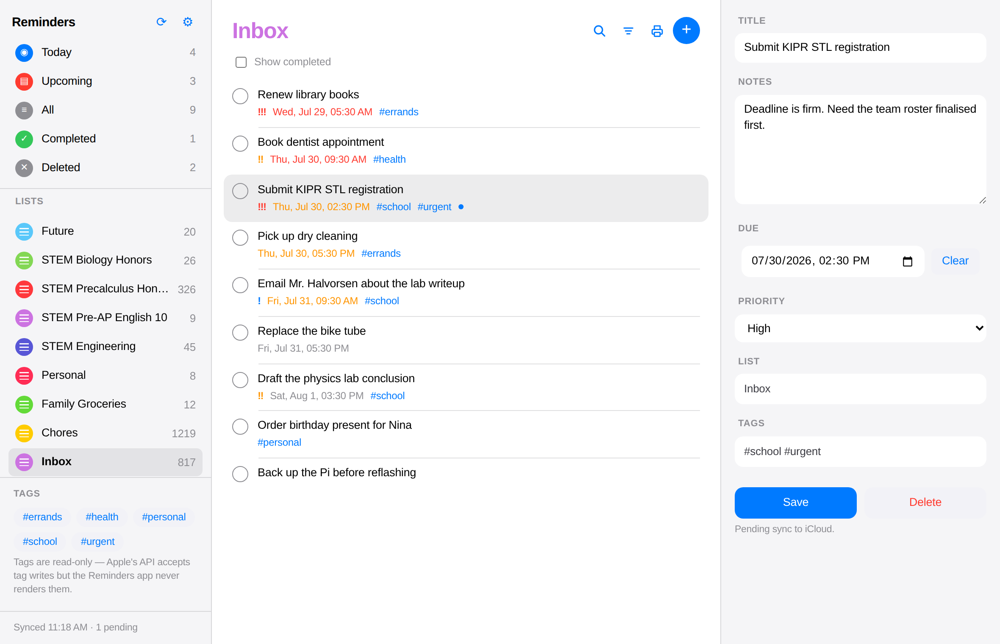
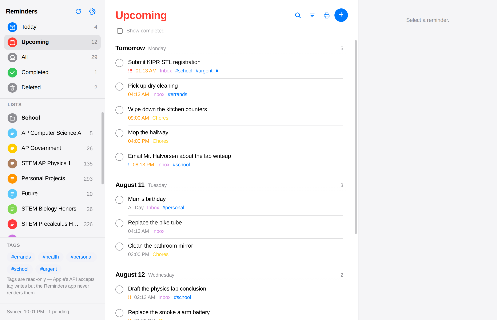
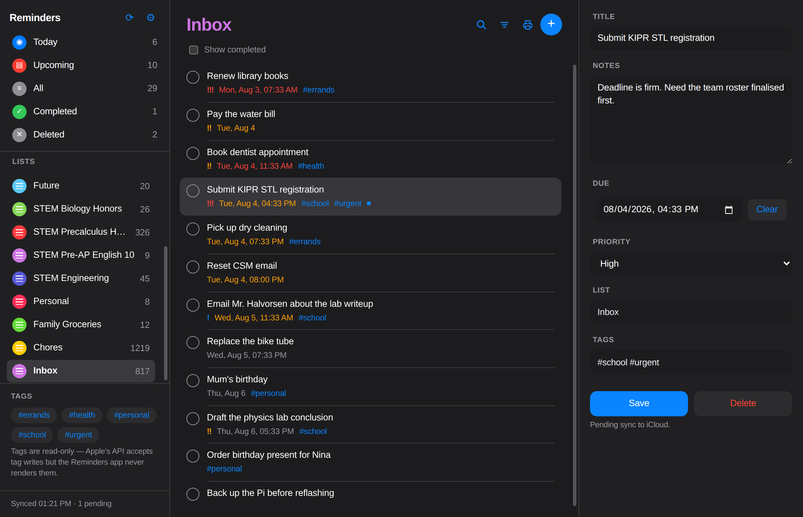
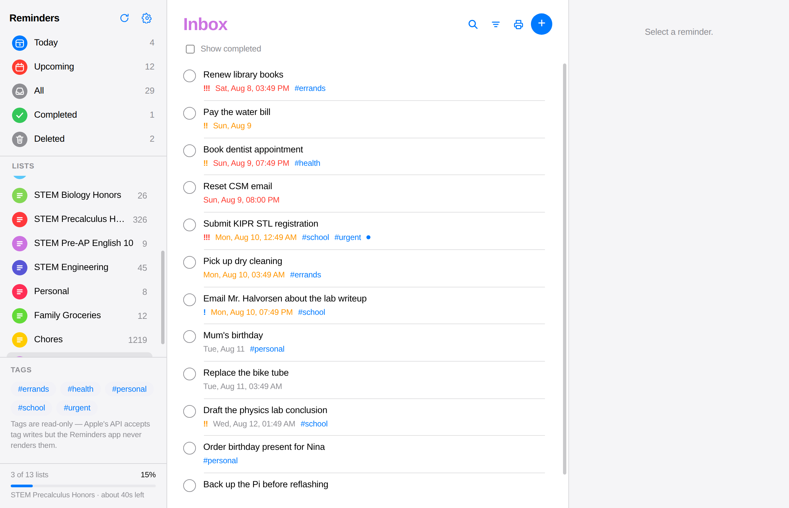
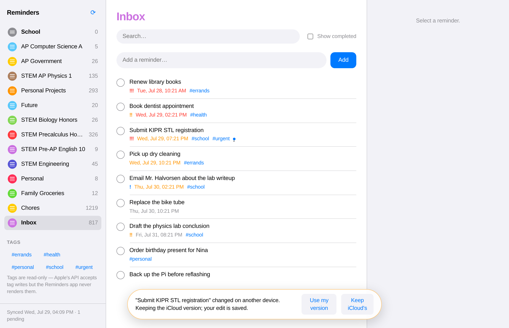
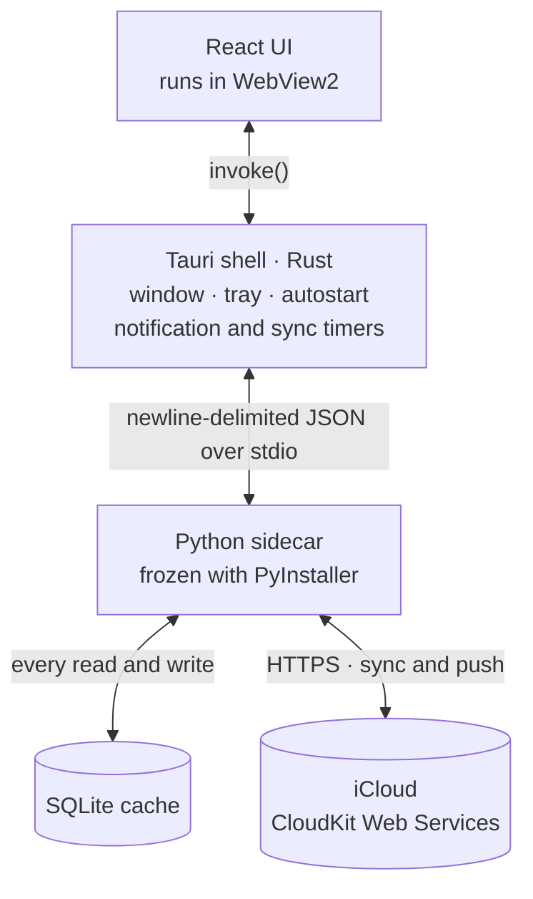

# iCloud Reminders for Windows

A desktop client for Apple Reminders, with the due-date notifications Windows
otherwise never gives you.



## Why this exists

Apple ships no Reminders client for Windows. iCloud.com has a web one, but it
has no notifications, no keyboard shortcuts, no offline access, and no reason to
be open in a tab all day.

The usual workaround — point a CalDAV client at iCloud — does not work. Apple
moved Reminders off CalDAV to a private CloudKit store with iOS 13. Your
reminders are not `VTODO` items on a CalDAV server any more, and no amount of
`.ics` will reach them. This talks to the same CloudKit Web Services endpoint
Apple's own clients use, through [pyicloud](https://github.com/timlaing/pyicloud).

That API is unofficial and undocumented. Everything below was established
against a real account rather than assumed, and where Apple's behaviour turned
out to be a wall, it is documented as a wall rather than worked around.

## What works

| | |
|---|---|
| Lists, reminders, detail pane | Read and write |
| Title, notes, due date, priority | Read and write |
| Smart lists | Today, Upcoming, All, Completed, Deleted |
| Tags | **Read and filter only** |
| Creating, renaming, deleting lists | **Not supported** |
| Background sync | Delta cursor, every 5–15 min, with progress and an ETA |
| Due-date notifications | 30-second tick, native Windows toast |
| Sorting | Per list: due date, priority, title, recently added |
| Search | Within a list or across everything |
| Printing | Any view, grouped, with tick boxes |
| Offline | Full read access; edits queue and push on reconnect |

### The two gaps are Apple's

Both were chased to a conclusion against a live account before being written
off. `spike/README.md` has the full findings.

**Tags cannot be written.** The API accepts a hashtag write and reads it back
correctly — but the Reminders app on the phone never renders it. Matching the
exact record shape an iPhone writes (`Name` as a `STRING` rather than pyicloud's
`ENCRYPTED_BYTES`) did not change that. Reading works fine, so tags are shown
and filterable, just not editable.

**Lists cannot be created.** A raw CloudKit `List` create is accepted and comes
back from `lists()` on the next read, but never reaches any device. Rename and
delete are the same story.

Out of scope by choice: smart list customisation, sections, subtasks,
attachments, location triggers, sharing, and natural-language date entry.

## Screenshots

| | |
|---|---|
|  |  |
| Upcoming, grouped by day the way Apple does it | Dark theme, following Windows or forced |
|  |  |
| Sync progress, weighted by list size | A conflict, kept rather than silently resolved |

## Using it

There are no published releases — [build it](#building), which produces an MSI
and an NSIS installer. Windows 11 has everything it needs at runtime; Windows 10
may want the
[WebView2 runtime](https://developer.microsoft.com/microsoft-edge/webview2/).

### First launch

Apple ID, password, then a 2FA code. After that a short setup covers what stays
running in the tray, notifications and start-with-Windows, and the two things
Apple will not allow — so they are known up front rather than discovered three
weeks later.

Closing the window hides it to the tray. That is deliberate: the scheduler has
to keep running for due-date toasts to be worth anything. Quit from the tray
menu.

### Staying signed in

iCloud expires session tokens on its own schedule, every few weeks. The password
goes to Windows Credential Manager via `keyring`, which is what lets the sidecar
rebuild a session from the stored credential and the trust token without
prompting. It does that on every launch, and again the moment a background sync
is refused. You see the sign-in screen when a restore actually fails — not on a
timer.

Turn it off under **Settings → Account** if you would rather type the password
each time. Signing out clears the stored credential either way.

## How it works



Three moving parts, each with one job:

- **Tauri shell (Rust)** — owns the window, the tray, autostart, and the two
  timers. Compiles to a real Win32 `.exe` with an MSI/NSIS installer, and uses
  the system WebView2 runtime rather than bundling a browser. It also supervises
  the sidecar: if that process dies, the shell respawns it and tells the UI.
- **Sidecar (Python)** — owns iCloud access and the cache. Frozen with
  PyInstaller and shipped beside the exe. It exists because pyicloud is the only
  working implementation of this protocol and it is Python; keeping it in a
  separate process means a network stall or a library crash cannot take the
  window with it.
- **UI (React + Vite)** — reconciled rather than rebuilt, so changing a filter
  re-renders the rows that differ instead of discarding the list.

**Every read the UI performs is a local SQLite query.** The network is never on
the critical path of a click. Writes go to the cache immediately and to an
outbox for the sidecar to push.

## Design notes

The parts that were not obvious.

### Time is the hard part

A reminder due "3 August at 8 PM" is a wall-clock fact, not a point on the
world's timeline, and Apple stores it as one: the CloudKit timestamp holds those
wall-clock fields encoded *as though the zone were UTC*, with a separate
`TimeZone` field naming the zone they belong to. Null means the reminder floats
— it fires at that wall-clock time wherever the device happens to be.

Reading that timestamp as a genuine instant is wrong by the local UTC offset,
and wrong in the direction that makes things look overdue early west of
Greenwich. An all-day reminder is the clearest case: stored as midnight, it
renders as 8:00 PM *the previous evening* at UTC-4 and lands under Overdue a
full day ahead of time.

`sidecar/reminders_sidecar/timeutil.py` is the only place the two
representations meet. Everything downstream works in true tz-aware UTC instants,
and the cache rejects naive datetimes outright. Writes run the same conversion
in reverse, so a due date set here shows the same time on the phone. The zone
comes from `tzlocal` rather than the current UTC offset, because an offset taken
today converts a January date an hour wrong.

`scripts/check-due-dates.py` prints both readings side by side against a live
account, if that ever needs re-confirming.

**All-day reminders** have a date and no time, so they display as *All Day*
rather than midnight, go late only once their day is over, and toast at 9am — a
notification fired at 00:00 is one nobody reads.

### Sleeping through due times

Reminders overdue by more than an hour are treated as missed while the machine
was away, and collapse into one summary toast. Freshly-due ones toast
individually, up to three; past that they collapse too. Waking the laptop to
fourteen separate notifications is worse than useless. The stale threshold is
configurable in Settings.

### Both devices write

Local edits go to an outbox carrying the CloudKit change tag they were made
against. If the record moved since, the push is recorded as a conflict rather
than forced: the iCloud copy wins in the cache so the UI matches reality, and
your version is preserved and offered back.

This matters because the phone was observed *replacing* a reminder's tag list
wholesale rather than merging it. Last-write-wins would silently eat data.

### Sync

Delta syncs use CloudKit's zone change cursor and are usually instant. One
wrinkle: `iter_changes()` only ever reports reminders, so a renamed or deleted
*list* would never appear through the cursor at all. Lists are therefore re-read
in full on every pass, delta included.

The progress bar is weighted by each list's reminder count rather than by
counting lists, because the work is wildly uneven — one list on the account this
was built against holds 1,219 of 2,900 records, and a bar advancing a
fourteenth per list would sit near the end for most of the sync. The ETA is
withheld below 8% and in the first few seconds, where extrapolating swings by
minutes between ticks. A delta sync has no knowable size, so it animates rather
than claiming a figure.

### The list

**Ordering happens in SQLite.** Sort mode and the Completed cap are applied by
the query, not by JavaScript afterwards — a 1,219-row list should never reach
the UI just to be reordered or truncated there. Sort is remembered per list, so
ordering Chores by due date leaves everything else alone.

**Completed shows 50.** The full history runs to thousands of rows on a real
account and nobody scrolls it. Fifty most-recently-completed, newest first.

**Date headings.** Views spanning more than one day group under Overdue / Today
/ Tomorrow / a real date, and rows under a heading show only their time, since
the date is already stated above them. Overdue and No Date are exceptions — they
span many days, so a bare time under them would read as *today*. Grouping is by
local calendar day, matching how the sidecar buckets Today.

**Priority is not ordinal.** Apple stores high as 1, medium as 5, low as 9 and
none as 0. Sorting numerically would put unprioritised items first.

### Printing

Any view prints, including a search or a smart list. Rows group by due date
(Overdue / Today / Tomorrow / This week / This month / Later), by priority, or
by list, and each gets an empty square to tick by hand. Notes and completed
items are optional. `break-inside: avoid` keeps a reminder off a page boundary.

### Look and feel

- **The app icon** is drawn by `scripts/make_icons.py` with no image library, as
  signed distance fields — exact distance to an edge antialiases cleanly at any
  size, and the drop shadow falls out of the same number. That shadow is what
  stops a white card disappearing on a white taskbar. Ten sizes are emitted,
  including the 20/24/40 that display scaling asks for and Windows otherwise
  fakes by resampling. Below 28px the art is redrawn rather than shrunk.
- **Sidebar glyphs** are SVG, not Unicode characters. The originals were U+25C9,
  U+25A4, U+2261 and friends — which shape you actually got depended on which
  installed font first claimed the codepoint. Today shows the real date, which
  is the only thing distinguishing it from Upcoming.
- **Motion** uses one easing curve, with one deliberate exception: a row being
  ticked off exits on an ease-*in*. The usual curve is front-loaded, which is
  right for something arriving and wrong for something leaving. The checkbox
  fills immediately while the write and reload happen behind it.
- **Scrollbars** are styled, because WebView2 otherwise draws the stock Windows
  scrollbar inside an app that is Apple everywhere else.
- **First paint** carries the theme background inline in `index.html`, ahead of
  the bundle, so a dark-theme launch does not start with a white flash. That
  inline script is allow-listed in the CSP by hash rather than by
  `'unsafe-inline'`, and a test recomputes the hash from both the source and the
  built copy — a blocked inline script fails silently, so the flash would just
  quietly return.
- Everything collapses under `prefers-reduced-motion`.

## Building

Needs Python 3.11+, Node 18+, and the Rust MSVC toolchain.

```powershell
winget install Rustlang.Rustup
# reopen PowerShell so PATH picks up cargo
rustup default stable-x86_64-pc-windows-msvc
```

Rust's MSVC toolchain also needs the C++ linker, which rustup does not install.
If a build fails with `link.exe not found`, install
`Microsoft.VisualStudio.2022.BuildTools` and tick **Desktop development with
C++**.

Check everything at once first:

```powershell
.\scripts\check-prereqs.ps1
```

Then:

```powershell
npm install
.\scripts\build-sidecar.ps1     # freezes the Python sidecar
npm run build                   # produces the installer
```

The installer lands in `src-tauri\target\release\bundle\`.

### Seeing a change

`git pull` on its own changes nothing you can run — the frontend is bundled into
the exe, the Rust is compiled, and the sidecar is frozen. What needs rebuilding
depends on what changed:

| Changed | Installed build | `npm run dev` |
|---|---|---|
| `src-react/` (React UI) | `npm run build`, reinstall | hot-reloads instantly |
| `src-tauri/` (Rust) | `npm run build`, reinstall | recompiles on save |
| `sidecar/` (Python) | `.\scripts\build-sidecar.ps1`, then `npm run build` | see below |
| `src-tauri/icons/` | `python scripts/make_icons.py`, rebuild, reinstall | — |

Windows caches app icons per executable, so a new icon may need
`ie4uinit.exe -show` or a sign-out before it appears.

### Development

```powershell
.\scripts\build-sidecar.ps1
$env:REMINDERS_SIDECAR = "$PWD\dist-sidecar\reminders-sidecar.exe"
npm run dev
```

To iterate on the sidecar without re-freezing it every time, run it from source:

```powershell
$env:REMINDERS_SIDECAR = "$PWD\.venv\Scripts\python.exe"
$env:REMINDERS_SIDECAR_ARGS = "-m reminders_sidecar"
npm run dev
```

That needs `pip install -e ./sidecar` in the venv once. Restart the app to pick
up a sidecar edit — the shell respawns it, no PyInstaller run involved.

> **Toasts will not appear under `npm run dev`.** Windows only delivers
> notifications for an application with a registered AppUserModelID, which the
> installer creates. Test notifications from an installed build. This is a
> Windows constraint, not a bug.

## Tests

```powershell
py -m venv .venv; .\.venv\Scripts\Activate.ps1
pip install ./sidecar pytest
cd sidecar; python -m pytest
```

137 tests, covering the things that are hard to check by looking: wall-clock and
timezone conversion, cache filtering and ordering, delta sync and conflict
recording, session restore, the stdio protocol contract, sleep/wake notification
batching, the frozen-build entry point, and the icon set — that every Windows
shell size exists, that the small art keeps its bullets, and that the CSP still
allows the inline script.

They run on Linux and macOS as well as Windows; nothing in the suite needs an
Apple account.

## Layout

```
sidecar/        Python: iCloud client, SQLite cache, sync, notification policy
  reminders_sidecar/
    icloud.py       pyicloud wrapper, normalisation, typed errors
    timeutil.py     Apple's wall-clock reminder times <-> real instants
    db.py           SQLite cache, queries, ordering, settings
    sync.py         Full and delta sync, outbox, conflicts
    notifications.py  What to toast, and what to collapse
    server.py       JSON-RPC over stdio
src-tauri/      Rust: window, tray, timers, sidecar supervision
src-react/      React UI, built by Vite into dist/
scripts/        Icon generation, sidecar freeze, build and account checks
tools/          Screenshot and print-layout tooling
spike/          Phase 1 validation scripts and findings
docs/           Screenshots
```

## Credits

Built on [pyicloud](https://github.com/timlaing/pyicloud) and
[Tauri](https://tauri.app). Not affiliated with or endorsed by Apple; iCloud and
Reminders are Apple trademarks. It uses an unofficial API that Apple can change
without notice.
