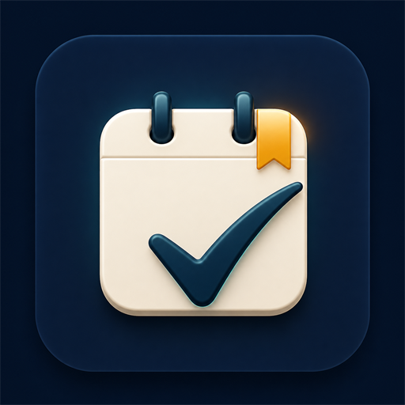

<div align="center">



# Reminders for Windows

**A native WinUI 3 client for iCloud Reminders, backed by Rust.**

</div>

Apple does not ship Reminders for Windows. This project provides a fast,
offline-capable Windows client with background sync and due-date notifications.
The interface is C# and WinUI 3 with no embedded browser or web frontend.
Node.js and npm are not required.

> This independent project is not authorized, sponsored, endorsed, or otherwise
> approved by Apple Inc. It uses private, undocumented iCloud interfaces that
> may change or stop working without notice. Read [LEGAL.md](LEGAL.md) before
> using or distributing the software.

## Quick start: demo mode

From the repository root, run:

```powershell
.\scripts\run-windows.ps1 -Demo
```

This launches the complete native UI with in-memory sample data. It does not
build or start the Rust sidecar, read the application cache, request
credentials, or connect to iCloud. Only the .NET 8 SDK is needed.

After creating a production build, demo mode can also be launched directly:

```powershell
.\dist-windows\Reminders.exe --demo
```

See [Getting started on Windows](docs/getting-started.md) for every supported
development, production, testing, and troubleshooting command.

## Build and run the complete application

Production prerequisites are:

- Windows 10 version 1809 or newer on x64;
- .NET 8 SDK or newer;
- Rust with the MSVC toolchain;
- Visual Studio 2022 or Build Tools with the Windows SDK and MSVC x64 tools.

The project restores its Windows App SDK dependencies through NuGet. It does
not require Node.js, npm, JavaScript packages, or a browser runtime.

```powershell
.\scripts\check-prereqs.ps1
.\scripts\build-windows.ps1
.\dist-windows\Reminders.exe
```

For a normal Debug development launch:

```powershell
.\scripts\run-windows.ps1
```

The production build is a self-contained x64 folder under `dist-windows`.
Keep that folder together because the native WinUI resources, Windows App SDK
runtime files, application icon, and Rust sidecar are all required.

ARM64 and MSIX are supported:

```powershell
.\scripts\build-windows.ps1 -Architecture ARM64
.\scripts\build-msix.ps1 -Architecture x64
.\scripts\build-msix.ps1 -Architecture ARM64
```

ARM64 portable output is written to `dist-windows-arm64`; packages are written
to `dist-msix`. MSIX files are unsigned unless a certificate thumbprint is
provided. See the getting-started guide for signing and Store identity options.

## What works

| Feature | Support |
|---|---|
| Lists and reminders | Read and write |
| Title, notes, due date, priority, completion and flags | Read and write |
| Smart lists | Today, Upcoming, All, Completed and Deleted |
| Search and sorting | Local SQLite queries; the network is not on the click path |
| Tags | Read and filter only (an upstream iCloud limitation) |
| Offline use | Full reads; edits queue and push after reconnecting |
| Authentication | Apple ID, 2FA, terms acceptance and session restoration |
| Conflicts | Preserved and explicitly resolved instead of overwritten |
| Windows integration | Native theme, controls, badges and due notifications |
| Sidebar | Persisted open/collapsed state with temporary hover expansion |

Creating or changing reminder lists is not supported because records created
through CloudKit Web Services do not propagate to Apple devices. The live
protocol findings are documented in
[docs/protocol-findings.md](docs/protocol-findings.md).

## Architecture

```text
WinUI 3 / C#
  native window, navigation, dialogs, theming and Windows integration
          |
          | newline-delimited JSON over private stdio
          v
Rust sidecar
  authentication, CloudKit, sync, conflicts and notification planning
          +-- SQLite cache and outbox
          +-- iCloud CloudKit Web Services
```

The sidecar remains a separate supervised process. A connector crash cannot
corrupt the UI process, and reminder reads are served by the local SQLite
cache. Normal application data is stored under
`%LOCALAPPDATA%\RemindersSync`; demo mode does not access it.

See [the native frontend notes](docs/native-windows-frontend.md) for the process
boundary and native control architecture.

## Tests

```powershell
cargo test --manifest-path .\sidecar\Cargo.toml --locked
dotnet build .\src-windows\Reminders.WinUI\Reminders.WinUI.csproj -c Release -p:Platform=x64
```

The Rust tests are account-free. Live iCloud interoperability testing should
use a disposable account and follow [SECURITY_AUDIT.md](SECURITY_AUDIT.md).

## Repository layout

```text
sidecar/                       Rust iCloud connector and offline engine
src-windows/Reminders.WinUI/  Native WinUI 3 frontend
scripts/                       Build, run and prerequisite checks
docs/                          Setup, protocol and architecture notes
```

## Credits

Maintained by Paul Savvas. Package publisher:
[paulsavvas.com](https://paulsavvas.com).

Apple and iCloud are trademarks of Apple Inc., registered in the U.S. and other
countries and regions. Apple product names are used only to describe
compatibility. See the [legal and service notice](LEGAL.md).
